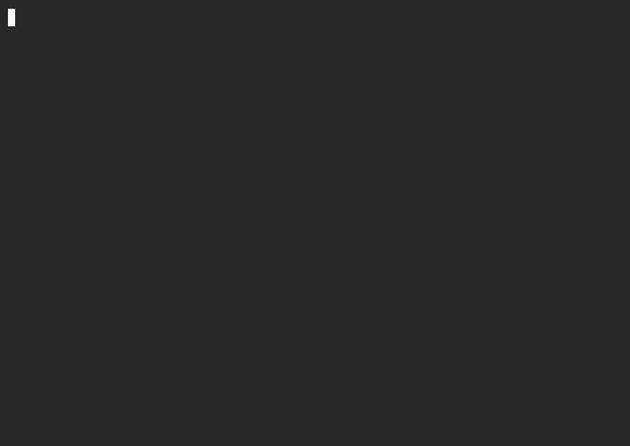

<p align="center"></p>

<p align="center"></p>

Laissez les bons temps rouler, cher — this here's a fast little router for your Mac.

`jevalaya` serves one simple endpoint and answers typed questions — *this or that, how much, yes or no* — by sending each request to the right pot: a tiny CoreML model on the Neural Engine when the ask is short, a local MLX Laya when it needs more room, and Jev (TypeSafe) when the answer's too close to call. You bring your own models and keys; jevalaya just does the routin', quick and honest.

## What it does

- `POST /predict` — the drop-in laya/jev predict contract: `{state, questions}` in, `{model, answers, usage, routing}` out.
- Routes by content: checkpoint family (english / multilingual / typed-decisions), rendered token count, and confidence — with a fallback hop from ANE to MLX and an escalation hop from local to Jev.
- Degrades graceful: runs fine on three backends, two, or just one — whatever's standin' is what you get, always with the full routing receipt.
- Every request writes a structured event (latency, backend, confidence, cost) to a JSONL stream — that's the lagniappe a future lil' app can visualize.
- Compare mode: ask for `compare=["ane","mlx","jev"]` and get every backend's answer side by side.

## See it work

<p align="center"></p>

Real terminal, real server — five beats: health, ANE on a short request, ANE on English (fit decides, not the detector), multi-question MLX, explicit Jev escalation, and a consumer verdict into `/feedback`.

**Want to watch the router think?** [The snake demo](docs/assets/snake-demo.mp4) is a little arcade game that lives entirely on `/predict`: a headline appears, the model classifies it, and the snake slithers to the bin the router chose — short headlines hit ANE, full articles route MLX, one scripted golden headline phones Jev, and a lag switch shows what a slow backend costs. The overlay is the raw routing receipt; the snake is presentation, not steering — the model picks the topic, the snake follows. Source in [`tools/demo/sorter/`](tools/demo/sorter/).

**Or watch the backends race:** [the head-to-head demo](docs/assets/race-demo.mp4) fires the same headline at ANE and MLX concurrently — two lanes, the server's own millisecond receipt in the middle of each line, score and p50 up top. Same checkpoint on both sides, so it's a pure lane race. Source: `race.html`/`race.js` in the same directory.

## Quick start

```bash
cargo build --workspace
cp config/jevalaya.example.toml jevalaya.toml   # point it at your model dirs
export JEVALAYA_TOKEN=local-dev                  # bearer for /predict
export TYPESAFE_API_KEY=...                      # only if you use Jev

./target/debug/jevalaya serve --config jevalaya.toml
```

```bash
curl -s http://127.0.0.1:8767/predict \
  -H "Authorization: Bearer $JEVALAYA_TOKEN" \
  -H "Content-Type: application/json" \
  -d '{
    "state": "Mein Konto wurde zweimal belastet",
    "questions": {"topic": {"type": "choice",
      "instructions": "what is this about?",
      "criteria": {"billing": "...", "shipping": "..."}}}
  }'
```

<p align="center"></p>

## The rules of the house

- ANE only gets short, single, multilingual questions (≤96 rendered tokens). English and typed-decisions never ride the Neural Engine.
- An ANE capacity/shape failure retries exactly once on MLX. A hard failure stays visible — we don't dress it up as an answer.
- Jev fires when you ask for it, when confidence runs too close, or on retry. It's the only path that leaves the machine.
- Keys live in your environment (Infisical-style), never in this repo.

## Layout

```
crates/
  render/            # canonical prompt + tokenizer parity port (the gate's ruler)
  router-core/       # decision table, dispatch, escalation, compare, events
  backend-mlx-pyo3/  # laya-mlx in-process via PyO3
  backend-jev/       # TypeSafe HTTP client
  backend-coreml/    # native ANE (Apple Silicon)
  jevalaya-server/   # axum + `jevalaya` CLI
docs/                # DESIGN.md (authoritative), smoke transcript
config/            # example TOML — copy and point at your models
```

## Install

From source, the whole workspace (default features: MLX + ANE):

```bash
export PYO3_PYTHON=/path/to/laya-mlx/.venv/bin/python  # the interpreter with mlx + laya_mlx
cargo build --workspace                                 # ./target/debug/jevalaya
```

No Python toolchain on the box? `cargo build -p jevalaya-server --no-default-features` gives you a Jev-only binary, no libpython needed. The ANE adapter compiles everywhere but only serves on Apple Silicon — off-target it registers unavailable instead of lyin' about it.

What you need besides the binary, cher:

- **Model dirs** — `[models]` english/multilingual/typed-decisions plus `[ane] model`: local dirs or HF cache snapshots (e.g. `~/.cache/huggingface/hub/models--aac6fef--...`). Copy `config/jevalaya.example.toml` to `jevalaya.toml` and point it at yours. Offline mode won't touch the network for hub resolution.
- **laya-mlx checkout + venv** (MLX backend only) — `[mlx] python_path` must include the dir containin' `laya_mlx/` and your venv's `site-packages`. We reuse it in-process; we never vendor it.
- **Env, not files** — `JEVALAYA_TOKEN` (bearer for `/predict`, configurable name via `auth_token_env`), `TYPESAFE_API_KEY` (only if Jev's enabled; Infisical-style).
- **`jevalaya check --config jevalaya.toml`** validates paths, tokenizer metadata, and backend wiring without loadin' weights. Then `serve`, same flag.
- **launchd note** — for always-on service, wrap `serve` in a LaunchAgent plist (program args + `KeepAlive`), logs to a file you rotate. Bind stays loopback unless your config says otherwise, on purpose.

## For agents building apps

Got your own state and your own questions? POST 'em to `/predict`, read the typed answers plus the routing receipt, and tell us how it went — the full deal (contract shapes, overrides, error codes, feedback schema, a curl and a Python snippet) is in `docs/CONSUMER-HANDOVER.md`. jevalaya don't know your domain and don't need to: define questions in your own words, watch `confidence`/`margin`/`escalated` in the receipt, and append judgments to the feedback sink so the thresholds learn your world, togetha.

## Consumers

Any project on the machine can ask jevalaya a question — define your `state` and your `questions`, POST to `/predict`, read the typed answer and the routing receipt. Start at `docs/CONSUMER-HANDOVER.md` and drop run feedback in the configured feedback sink so we can tune the thresholds togetha.

## Status

Milestone build: routing core, MLX bridge, and Jev client verified end-to-end; CoreML ANE adapter in progress. See `docs/DESIGN.md` for the full contract.
