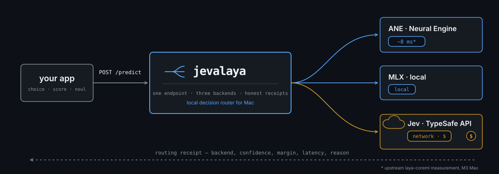
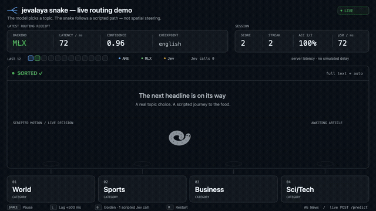
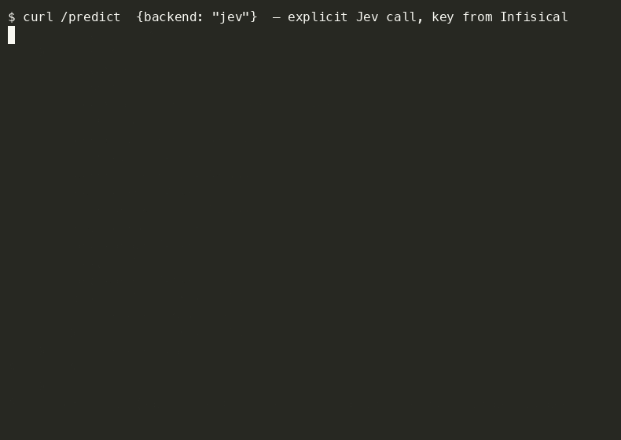
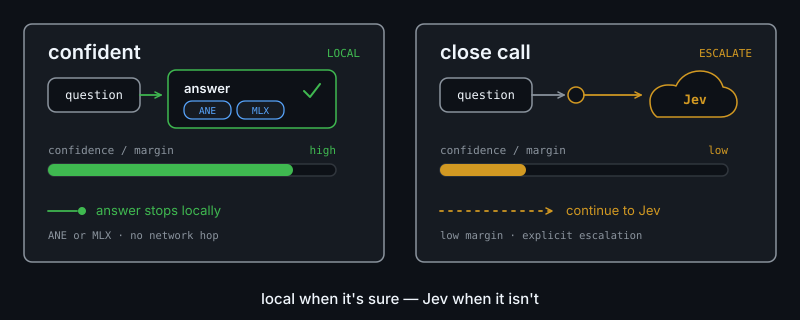

<p align="center"></p>

# Keep calling Jev. Most of it never leaves the Mac.

*"But we have Jev at home?" — yeah, and it answers in ~18ms.*

Same drop-in `/predict`. Same `{state, questions}`. jevalaya is a tiny Rust house band for Apple Silicon: short calls hit the Neural Engine, roomier ones ride local MLX, and Jev (TypeSafe) only gets the ticket when confidence/margin say it earned it. Every response carries a routing receipt — backend, latency, reason. Laissez les bons temps rouler.

<p align="center"></p>

## See it work

### 1. The burst

`backend: ane / mlx` `ms: server-reported` `reason: explicit_backend`

<p align="center"><a href="docs/assets/race-demo.mp4"></a></p>

[Watch the burst race (MP4)](docs/assets/race-demo.mp4)

<details>
<summary>Inside the burst</summary>

**Or watch the backends race:** [the head-to-head demo](docs/assets/race-demo.mp4) fires the same headline as a 4-call burst at ANE and MLX concurrently — two lanes, each marker at its server-measured latency. ANE drains the burst in a tight cluster; MLX stair-steps out as calls serialize on the bridge. Same checkpoint on both sides; redirects land on the answering backend's lane as hollow rings, and Jev answers appear separately in amber. Source: `race.html`/`race.js` in the same directory.

</details>

### 2. The snake

`backend: ane / mlx / jev` `ms: server-reported` `reason: per receipt`

<p align="center"><a href="docs/assets/snake-demo.mp4"></a></p>

[Watch the snake demo (MP4)](docs/assets/snake-demo.mp4)

<details>
<summary>Inside the snake</summary>

**Want to watch the router think?** [The snake demo](docs/assets/snake-demo.mp4) is a little arcade game that lives entirely on `/predict`: a headline appears, the model classifies it, and the snake slithers to the bin the router chose — short headlines hit ANE, full articles route MLX, one scripted golden headline phones Jev, and a lag switch shows what a slow backend costs. The overlay is the raw routing receipt; the snake is presentation, not steering — the model picks the topic, the snake follows. Source in [`tools/demo/sorter/`](tools/demo/sorter/).

</details>

### 3. The phone home

`backend: jev` `ms: server-reported` `reason: … escalated to jev`

*real Jev API calls on camera — key from Infisical, paid cloud, named reason, same /predict.*

<p align="center"></p>

[Inspect the recorded receipts](docs/assets/jev-demo.cast) · [full routing demo (GIF)](docs/assets/demo.gif) · [cast](docs/assets/demo.cast)

<details>
<summary>Timing and accuracy, in context</summary>

| Measurement | Context |
| --- | --- |
| ~18ms p50 | 4-call ANE burst on M1 Max |
| ~8ms | upstream laya-coreml on M3 Max |
| ~93% | local AG News |

</details>

## What it does

- `POST /predict` — the drop-in laya/jev predict contract: `{state, questions}` in, `{model, answers, usage, routing}` out.
- Routes by content: checkpoint family (english / multilingual / typed-decisions), rendered token count, and confidence — with a fallback hop from ANE to MLX and an escalation hop from local to Jev.
- Degrades graceful: runs fine on three backends, two, or just one — whatever's standin' is what you get, always with the full routing receipt.
- Every request writes a structured event (latency, backend, confidence, cost) to a JSONL stream — that's the lagniappe a future lil' app can visualize.
- Compare mode: ask for `compare=["ane","mlx","jev"]` and get every backend's answer side by side.

**Point it at your models, keep TYPESAFE_API_KEY for the ones that earn the ride, keep POSTing /predict. Same Jev. Smarter pots.**

## Quick start

Grab the prebuilt binary from [Releases](https://github.com/chriscoveries/jevalaya/releases) (`jevalaya-v0.1.0-macos-aarch64.tar.gz` — Apple Silicon), or build from source:

```bash
cargo build --workspace
cp config/jevalaya.example.toml jevalaya.toml   # point it at your model dirs
export JEVALAYA_TOKEN=local-dev                  # bearer for /predict
export TYPESAFE_API_KEY=...                      # only if you use Jev

./target/debug/jevalaya serve --config jevalaya.toml
```

```bash
curl -s http://127.0.0.1:8767/predict \
  -H "Authorization: Bearer $JEVALAYA_TOKEN" \
  -H "Content-Type: application/json" \
  -d '{
    "state": "Mein Konto wurde zweimal belastet",
    "questions": {"topic": {"type": "choice",
      "instructions": "what is this about?",
      "criteria": {"billing": "...", "shipping": "..."}}}
  }'
```

<p align="center"></p>

## The rules of the house

- ANE only gets short, single questions that fit the exported CoreML head (≤96 rendered tokens) — english and multilingual both ride the Neural Engine when the fit gate passes. Fit decides, not the language detector.
- An ANE capacity/shape failure retries exactly once on MLX. A hard failure stays visible — we don't dress it up as an answer.
- Jev fires when you ask for it, when confidence runs too close, or on retry. It's the only path that leaves the machine.
- Keys live in your environment (Infisical-style), never in this repo.

## Layout

```
crates/
  render/            # canonical prompt + tokenizer parity port (the gate's ruler)
  router-core/       # decision table, dispatch, escalation, compare, events
  backend-mlx-pyo3/  # laya-mlx in-process via PyO3
  backend-jev/       # TypeSafe HTTP client
  backend-coreml/    # native ANE (Apple Silicon)
  jevalaya-server/   # axum + `jevalaya` CLI
docs/                # DESIGN.md (authoritative), smoke transcript
config/            # example TOML — copy and point at your models
```

## Install

From source, the whole workspace (default features: MLX + ANE):

```bash
export PYO3_PYTHON=/path/to/laya-mlx/.venv/bin/python  # the interpreter with mlx + laya_mlx
cargo build --workspace                                 # ./target/debug/jevalaya
```

No Python toolchain on the box? `cargo build -p jevalaya-server --no-default-features` gives you a Jev-only binary, no libpython needed. The ANE adapter compiles everywhere but only serves on Apple Silicon — off-target it registers unavailable instead of lyin' about it.

What you need besides the binary, cher:

- **Model dirs** — `[models]` english/multilingual/typed-decisions plus `[ane] model`: local dirs or HF cache snapshots (e.g. `~/.cache/huggingface/hub/models--aac6fef--...`). Copy `config/jevalaya.example.toml` to `jevalaya.toml` and point it at yours. Offline mode won't touch the network for hub resolution.
- **laya-mlx checkout + venv** (MLX backend only) — `[mlx] python_path` must include the dir containin' `laya_mlx/` and your venv's `site-packages`. We reuse it in-process; we never vendor it.
- **Env, not files** — `JEVALAYA_TOKEN` (bearer for `/predict`, configurable name via `auth_token_env`), `TYPESAFE_API_KEY` (only if Jev's enabled; Infisical-style).
- **`jevalaya check --config jevalaya.toml`** validates paths, tokenizer metadata, and backend wiring without loadin' weights. Then `serve`, same flag.
- **launchd note** — for always-on service, wrap `serve` in a LaunchAgent plist (program args + `KeepAlive`), logs to a file you rotate. Bind stays loopback unless your config says otherwise, on purpose.

## For agents building apps

Got your own state and your own questions? POST 'em to `/predict`, read the typed answers plus the routing receipt, and tell us how it went — the full deal (contract shapes, overrides, error codes, feedback schema, a curl and a Python snippet) is in `docs/CONSUMER-HANDOVER.md`. jevalaya don't know your domain and don't need to: define questions in your own words, watch `confidence`/`margin`/`escalated` in the receipt, and append judgments to the feedback sink so the thresholds learn your world, togetha.

## Consumers

Any project on the machine can ask jevalaya a question — define your `state` and your `questions`, POST to `/predict`, read the typed answer and the routing receipt. Start at `docs/CONSUMER-HANDOVER.md` and drop run feedback in the configured feedback sink so we can tune the thresholds togetha.

## Status

Routing core, CoreML ANE adapter, MLX bridge, and Jev client verified end-to-end — all three backends answer live in the demos above. See `docs/DESIGN.md` for the full contract.
